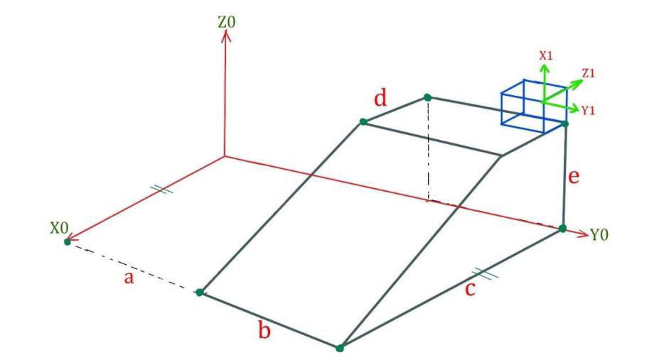
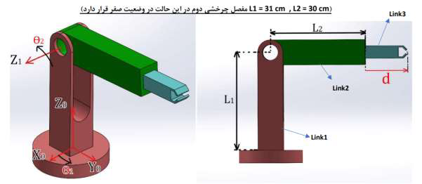
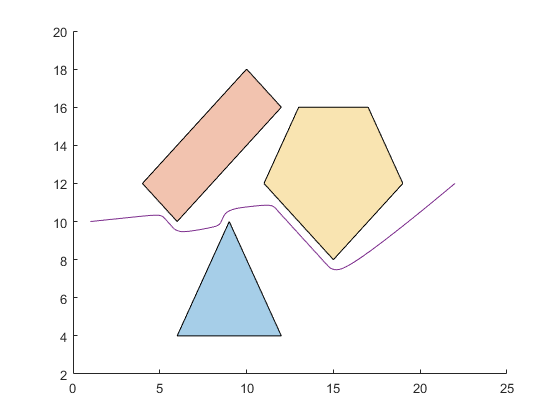
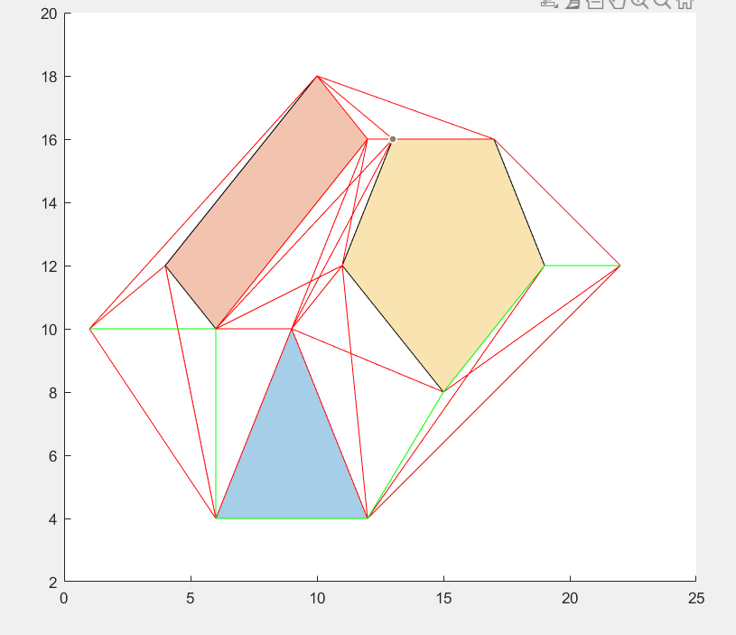

# Robotics Coursework

MATLAB/Simulink homework from an undergraduate Robotics course (Sharif University of Technology), covering rigid-body kinematics through motion planning for serial manipulators and mobile robots.

## Gallery

<table>
<tr>
<td width="50%"> <b>HW1</b> — rigid-body transform problem setup</td>
<td width="50%"> <b>HW3</b> — CAD model of the RRP manipulator</td>
</tr>
<tr>
<td width="50%"> <b>HW6</b> — potential-field path threading between obstacles</td>
<td width="50%"> <b>HW7</b> — shortest path found via Dijkstra's algorithm</td>
</tr>
</table>

**HW5 simulation clips** (trajectory tracking, two scenarios):

<video src="HW5/model/HW5_Q1.mp4" controls width="420"></video>

*(if the players above doesn't render, the clip is at [`HW5/model/HW5_Q1.mp4`](HW5/model/HW5_Q1.mp4))*

Each `HW#/` folder contains:
- `assignment.pdf` — the problem statement
- `report_fa.pdf` — my original written solution and analysis (Persian)
- `report_en.pdf` — an English translation of the above
- `code/` — MATLAB scripts implementing the solution
- `model/` — Simulink models and SolidWorks CAD parts, where the assignment involved simulation (not every homework has one)
- `figures/` — diagrams/plots from the report, where present

## Topics by assignment

| # | Topic | Key files |
|---|---|---|
| [HW1](HW1) | Rotation & translation matrices (rigid-body transforms) | `Rot.m`, `Trans.m` |
| [HW2](HW2) | Modeling an RPP manipulator: kinematics + Simulink/Simscape model | `HW2.m`, `model/HW2_Model.slx` |
| [HW3](HW3) | Modeling an RRP manipulator: inverse kinematics + Simulink/Simscape model | `InvKin.m`, `model/HW3_Model.slx` |
| [HW4](HW4) | Velocity kinematics: Jacobian computation | `JcbCalc.m` |
| [HW5](HW5) | Trajectory planning for the RRP manipulator (dynamic simulation) | `model/HW5_Model_1.slx`, `model/HW5_Model_2.slx` (result videos included) |
| [HW6](HW6) | Motion planning: potential-field path generation & obstacle avoidance, random walk | `Path_generator.m`, `random_walk.m` |
| [HW7](HW7) | Path planning via Dijkstra's algorithm on a graph | `dijkstra.m`, `graph_generator.m` |
| [HW8](HW8) | Final Simulink control model — *no separate written report exists for this one; the report file in this folder is a leftover duplicate of HW7's, kept only for transparency* | `model/HW8_Model.slx` |

## Tools

MATLAB, Simulink, and SolidWorks (link/part CAD models used in the Simulink simulations).
